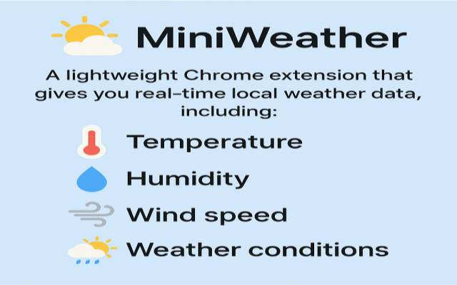
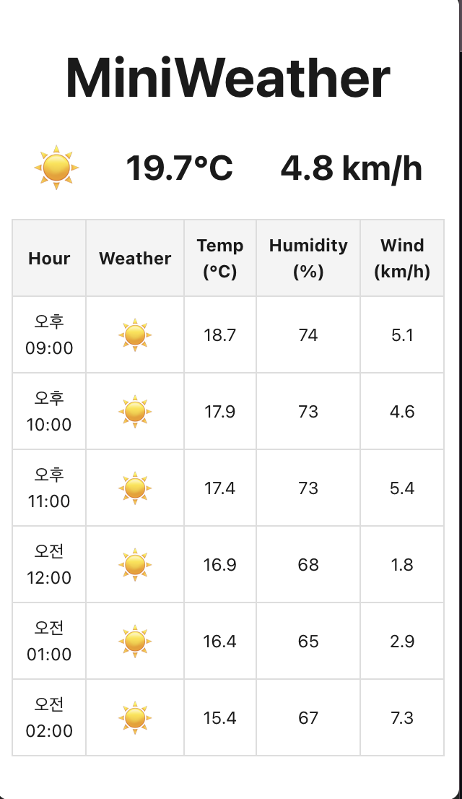

# 🌤️ MiniWeather - 실시간 날씨 정보 크롬 확장 프로그램

**MiniWeather**는 사용자의 현재 위치를 기준으로 **실시간 지역 날씨 정보**를 간편하게 확인할 수 있는 **경량 크롬 확장 프로그램**입니다.  
이 확장은 **React**로 개발되었으며, 빠른 속도와 직관적인 UI를 최우선으로 고려했습니다.

  

## 🔍 주요 기능

- 📍 **자동 위치 감지**  
  사용자의 브라우저 위치 정보를 활용하여 가장 정확한 지역 날씨 데이터를 제공합니다.  
  *(※ 위치 권한이 필요합니다.)*

- 🌡️ **실시간 날씨 정보 제공**  
  현재 온도, 습도, 풍속, 날씨 상태(아이콘 포함)를 빠르게 확인할 수 있습니다.

- 🕒 **시간대별 예보 표시**  
  한눈에 보기 쉬운 **테이블 형식**으로 시간대별 예보를 제공합니다.

- ⚡ **빠른 속도, 간편한 UI**  
  불필요한 기능 없이 핵심 정보만 제공하여 **쾌적한 사용 경험**을 제공합니다.

- 🔒 **개인 정보 저장 없음**  
  모든 기능은 **브라우저 내에서만 실행**되며, 사용자 정보는 저장하거나 수집하지 않습니다.

- ✅ **로그인/회원가입 불필요**

## 📦 다운로드 

1. 크롬 웹스토어에서 mini-whether-extension 검색 후 다운로드 
2. [다운로드](https://chromewebstore.google.com/detail/mini-whether-extension/chgekmjhbiliefljmdmccjboindjfddb?utm_source=ext_app_menu)

